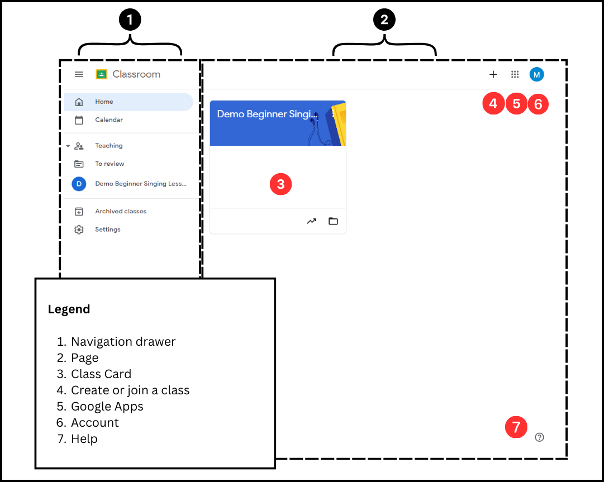
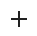

# Classroom Quick Reference
*This article is for teachers.*  

Welcome to Classroom, your digital education platform. Classroom has all the tools you need to organize your classes, manage assignments, and communicate with students and parents. 

## Getting Around  
Classroom is organized with a toolbar at the top and navigation drawer on the left. The toolbar is a global feature that is pinned at the top of the window, so it’s always accessible no matter where you are on the platform. 

The active page is displayed on the right. 

**Tip:**
* Click Menu  to expand or minimize the navigation drawer.
 

*Figure: Example Classroom home page.*

## Classroom Basic Structure

| Item | Description           | 
|-------------|-------------------|
| Navigation Drawer | Lists your Classroom pages and classes. The term “drawer” is used because the menu is collapsible. | 
| Page | Displays the active content. The figure above shows an example of what Classroom looks like when the home page is active. | 

### Utility Bar Icons
Additional utility buttons are located on the toolbar in the upper right-hand corner. 

| Icon | Name           | Function   |
|-------------|-------------------|---------------|
|    | Plus Sign | Click to create or join a class. Visible only on the home page. |
|  | Google App Chiclets | Click for a dropdown of all your Google apps. |
|  | Account Avatar | Click to access your Google account, sign in and out, or switch between accounts. |
|  | Question Mark | Click here for options if you have a question or need support. |

### Pages
Different areas of the Classroom are organized as pages. You can move around your Classroom by clicking on pages in the navigation drawer.

| Page Type | Description           | 
|-------------|-------------------|
| Home | View your Classroom at a glance. | 
| Calendar | View your classwork due dates in a calendar view. |
| Archived classes | View a list of your archived classes. | 
| Settings | Access your Google account settings and set your email notifications. |

### Teaching Pages
Two types of pages are nested under the Teaching toggle: the To Review page and class pages. These pages further organize information into tabs.  

| Page Type | Tab           | Description   |
|-------------|-------------------|---------------|
| To review  | To review | List of all active assignments across your classes. |
|  | Reviewed | List of assignments you marked as reviewed. |
| Class| Stream | Overview of class details, announcements, and due dates. |
|  | Classwork | List of all topics and materials associated with the class.|
|  | People | List of teachers and students associated with the class. |
|  | Grades | List of grades by student and assignment. |

## Learn More

[Get started with Classroom for teachers.](https://support.google.com/edu/classroom/answer/9582854?hl=en&co=GENIE.Platform%3DDesktop&oco=0)
